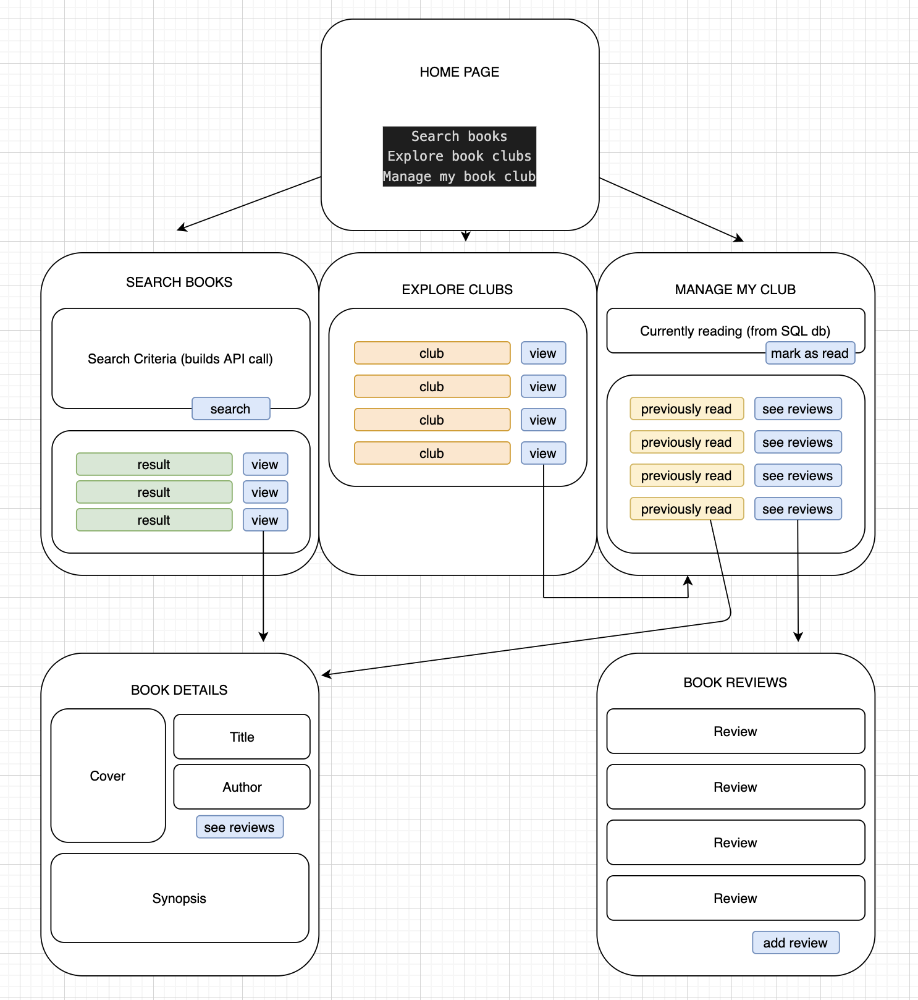

# APPLICATION TITLE

## USER STORY

WHO: As a book lover and someone who's interpersonal relationships are important to me

WHAT: I need a way to (1.) find, aggregate and manage list of books to read and discuss with my chosen book club group and (2.) interact with, view, and get recommendations from other book club groups. 

WHY: This app will help me and others 
- Organize my book club members
- Organize the books we are focused on
- Maintain a list of books and ratings based on our group
- Connect with other book club groups and view their read and rated books

## APIs to use: 
- Google Books API - https://developers.google.com/books/docs/v1/using
- Open Library API - https://openlibrary.org/dev/docs/restful_api
- NYT API = https://developer.nytimes.com/docs/books-product/1/routes/lists/best-sellers/history.json/get; gets everything but pic
    
## WIRE FRAME

